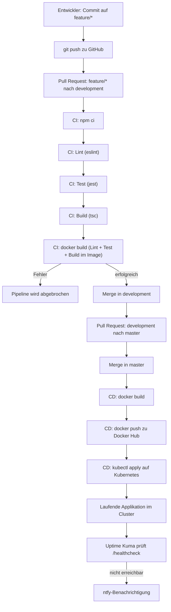
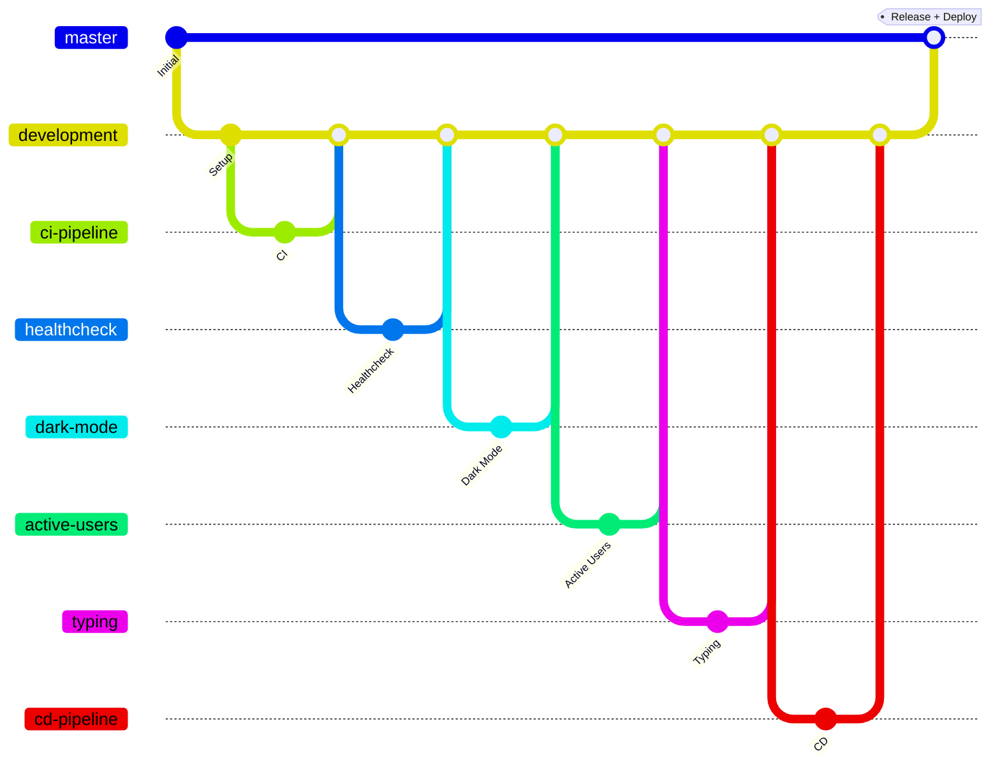
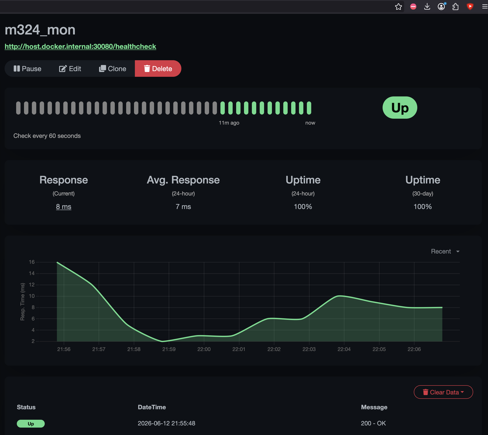
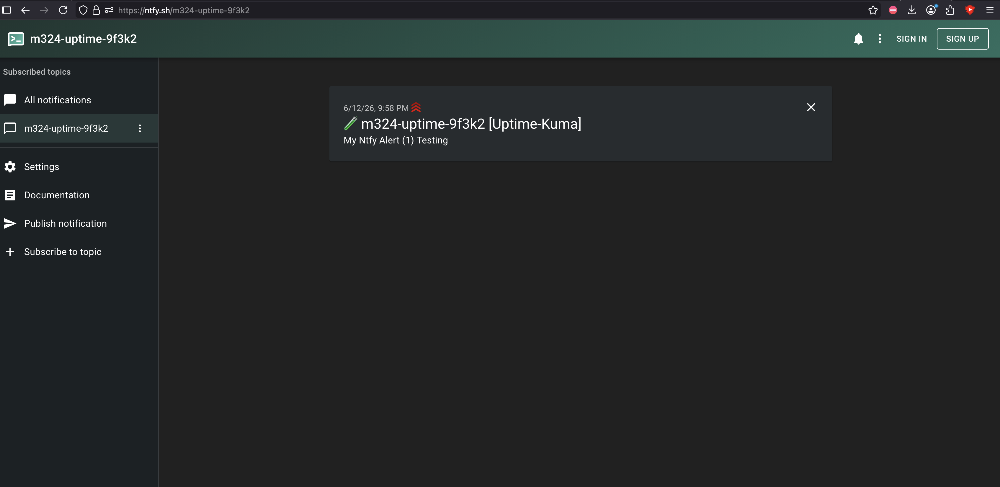
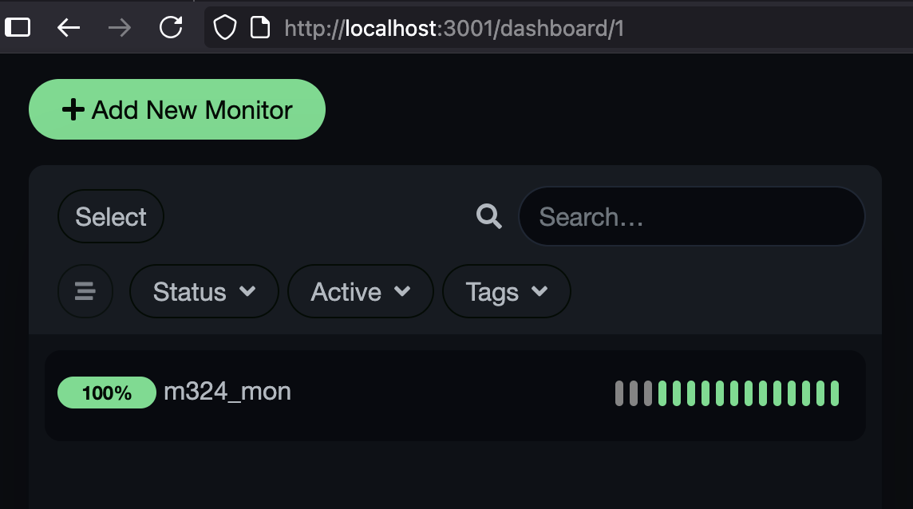

# DevOps-Dokumentation – M324 Chat-Applikation

Diese Dokumentation beschreibt die umgesetzten DevOps-Prozesse für die bestehende
Chat-Applikation: den CI/CD-Prozess, die angewendete Branching-Strategie sowie das
Monitoring mit Uptime Kuma. Sie richtet sich an eine unbeteiligte Entwicklerin oder
einen unbeteiligten Entwickler, der den Prozess nachvollziehen können soll.

> Die Diagramme sind in Mermaid geschrieben und werden direkt auf GitHub grafisch
> dargestellt.

---

## 1. Übersicht der Applikation

| Bereich | Technologie |
|---|---|
| Backend | TypeScript, Express, WebSockets (`ws`) |
| Frontend | HTML, Vanilla JavaScript, TailwindCSS |
| Linting | ESLint (Flat Config) |
| Testing | Jest (`ts-jest`) |
| Build / Artefakt | TypeScript-Compiler (`tsc`) und mehrstufiges Docker-Image |
| Registry | Docker Hub |
| Deployment | Kubernetes (lokaler Cluster über Docker Desktop) |
| Monitoring | Uptime Kuma mit ntfy-Benachrichtigung |

Die Applikation stellt einen REST-Endpunkt `GET /healthcheck` zur Verfügung. Dieser
gibt bei einem gesunden Zustand den Status `200 OK` mit dem Inhalt `{ "status": "OK" }`
zurück. Der Endpunkt wird sowohl von den Kubernetes-Proben als auch von Uptime Kuma
verwendet.

---

## 2. CI/CD-Prozess

### 2.1 Grafische Übersicht



### 2.2 Continuous Integration (CI)

Die CI-Pipeline ist in `.github/workflows/ci.yml` definiert und läuft auf einem
**self-hosted Runner**. Sie wird bei jedem Pull Request sowie bei jedem Push auf einen
`feature/*`- oder den `development`-Branch ausgelöst. Die Pipeline durchläuft folgende
Schritte. Schlägt ein Schritt fehl, wird die Pipeline sofort abgebrochen und der Code
kann nicht gemergt werden.

1. **`npm ci`** – Installiert die Abhängigkeiten reproduzierbar aus der `package-lock.json`.
2. **Lint (`npm run lint`)** – Prüft den TypeScript-Code mit ESLint gegen das definierte
   Regelwerk. Bei Verstössen wird die Pipeline gestoppt.
3. **Test (`npm test`)** – Führt die Unit-Tests mit Jest aus (unter anderem ein Test für
   den `/healthcheck`-Endpunkt). Bei fehlschlagenden Tests wird die Pipeline gestoppt.
4. **Build (`npm run build`)** – Kompiliert den TypeScript-Code mit `tsc` in den Ordner
   `build/`. Bei Kompilierfehlern wird die Pipeline gestoppt.
5. **Docker-Build (`docker build`)** – Baut das Docker-Image. Das mehrstufige
   `Dockerfile` führt in der Build-Stufe `Lint`, `Test` und `Build` **erneut innerhalb
   des Image-Builds** aus. Damit laufen die Pipeline-Schritte auch im Build-Prozess des
   Docker-Images; schlägt einer davon fehl, scheitert der Image-Build.

### 2.3 Continuous Deployment (CD)

Die CD-Pipeline ist in `.github/workflows/cd.yml` definiert und läuft ebenfalls auf einem
**self-hosted Runner**. Sie wird ausgelöst, sobald Code in den `master`-Branch gemergt
wird (in der Regel durch das Mergen eines Pull Requests von `development` nach `master`).

1. **Anmeldung bei Docker Hub** – mit den Secrets `DOCKERHUB_USERNAME` und
   `DOCKERHUB_TOKEN`.
2. **Image bauen und taggen** – Das Image wird mit dem Commit-SHA und mit `latest`
   getaggt.
3. **Push zu Docker Hub** – Das Artefakt wird in die Registry hochgeladen und kann danach
   vom Cluster konsumiert werden.
4. **Deployment auf Kubernetes** – Das Skript `k8s/deploy.sh` setzt den Image-Tag in das
   Deployment-Manifest ein (`kubectl apply`) und wartet auf das erfolgreiche Rollout.
   Da der Runner lokal auf der Entwicklermaschine läuft, erreicht er den lokalen
   Kubernetes-Cluster direkt.

Die Kubernetes-Manifeste liegen im Ordner `k8s/`:

- `namespace.yaml` – Namespace `m324`.
- `deployment.yaml` – Deployment mit Liveness- und Readiness-Proben auf `/healthcheck`.
- `service.yaml` – NodePort-Service, erreichbar unter `localhost:30080`.

---

## 3. Branching-Strategie

### 3.1 Grafische Übersicht

> Im Diagramm sind die Feature-Branches aus Platzgründen verkürzt dargestellt. Die
> vollständigen Namen im Repository lauten: `feature/ci-pipeline`,
> `feature/healthcheck-endpoint`, `feature/dark-mode`, `feature/active-users-list`,
> `feature/typing-indicator` und `feature/cd-pipeline`. Jeder Merge in `development`
> entspricht einem Pull Request.



### 3.2 Die drei Ebenen

- **`master`** – Produktions-Branch. Enthält nur freigegebenen, lauffähigen Code. Ein
  Merge auf `master` löst automatisch das Deployment aus (CD).
- **`development`** – Integrations-Branch. Hier werden alle fertigen Features gesammelt
  und gemeinsam getestet, bevor sie nach `master` gelangen.
- **`feature/*`** – Pro Anforderung (Issue) wird ein eigener Feature-Branch von
  `development` erstellt.

### 3.3 Konkretes Vorgehen für Entwickler

1. **Issue auswählen** und auf dem Kanban-Board in den Status «In Arbeit» setzen.
2. **Feature-Branch erstellen** von `development`:
   ```bash
   git checkout development
   git pull
   git checkout -b feature/<aussagekräftiger-name>
   ```
3. **Entwickeln und committen** in kleinen, nachvollziehbaren Commits.
4. **Branch pushen** und einen **Pull Request nach `development`** eröffnen.
5. **CI abwarten:** Die CI-Pipeline (Lint, Test, Build, Docker-Build) muss grün sein.
   Ist sie rot, darf nicht gemergt werden.
6. **Code-Review:** Der Pull Request wird kommentiert und anschliessend gemergt (siehe
   Hinweis 3.4).
7. **Feature-Branch löschen** nach dem Merge.
8. Wenn `development` einen stabilen, abgabereifen Stand hat, wird ein **Pull Request von
   `development` nach `master`** eröffnet. Der Merge löst die CD-Pipeline und damit das
   Deployment aus.

### 3.4 Hinweis zum Code-Review (Einzelbearbeitung)

Dieses Projekt wurde alleine bearbeitet. GitHub erlaubt es nicht, einen eigenen Pull
Request formal zu genehmigen («approven»). Die Pull Requests wurden deshalb mit einem
dokumentierten **Self-Review-Kommentar** versehen und anschliessend selbst gemergt. Der
Prozess (Branch → Pull Request → Review-Kommentar → Merge) wurde also vollständig
eingehalten; lediglich die Freigabe durch ein zweites Teammitglied entfällt
bauartbedingt.

---

## 4. Monitoring mit Uptime Kuma

Uptime Kuma überwacht die Verfügbarkeit der Applikation kontinuierlich und benachrichtigt
per ntfy-Push-Benachrichtigung, sobald die Applikation nicht mehr erreichbar ist. Uptime
Kuma wird lokal über `docker-compose.monitoring.yml` gestartet:

```bash
docker compose -f docker-compose.monitoring.yml up -d
# Oberfläche danach unter http://localhost:3001
```

### 4.1 Healthcheck-Monitor

Es wird ein **HTTP(s)-Monitor** eingerichtet, der den Healthcheck-Endpunkt der
Applikation regelmässig abfragt.

| Einstellung | Wert |
|---|---|
| Monitor-Typ | HTTP(s) |
| Name | m324_mon |
| URL | `http://host.docker.internal:30080/healthcheck` |
| Heartbeat-Intervall | 60 Sekunden |
| Erwarteter Status-Code | 200 |

> Hinweis: `host.docker.internal` wird verwendet, weil Uptime Kuma in einem Container
> läuft und so den NodePort der Applikation auf dem Host (`localhost:30080`) erreicht.



### 4.2 ntfy-Benachrichtigung (Notifier)

Als Benachrichtigungskanal wird ein **ntfy-Notifier** konfiguriert. Er wird dem Monitor
zugewiesen und löst aus, sobald der Monitor den Status «Down» (oder wieder «Up») meldet.
ntfy benötigt weder Konto noch Passwort – es genügt ein selbst gewähltes, eindeutiges Topic.

| Einstellung | Wert |
|---|---|
| Notification-Typ | ntfy |
| Server-URL | `https://ntfy.sh` |
| Topic | ein selbst gewähltes, eindeutiges Topic |
| Priorität | Standard |

Der folgende Screenshot zeigt eine über ntfy empfangene Test-Benachrichtigung von
Uptime Kuma – der Benachrichtigungskanal funktioniert damit end-to-end.



### 4.3 Übersicht / Dashboard



> Die Screenshots werden nach der Einrichtung von Uptime Kuma im Ordner
> `docs/screenshots/` abgelegt (siehe `docs/screenshots/README.md`).

---

## 5. Verzeichnis der wichtigsten Artefakte

| Datei / Ordner | Zweck |
|---|---|
| `.github/workflows/ci.yml` | CI-Pipeline (Lint, Test, Build, Docker-Build) |
| `.github/workflows/cd.yml` | CD-Pipeline (Docker Hub + Kubernetes) |
| `Dockerfile` | Mehrstufiges Image; führt Lint/Test/Build im Build aus |
| `k8s/` | Kubernetes-Manifeste und `deploy.sh` |
| `docker-compose.monitoring.yml` | Uptime Kuma |
| `server/index.ts` | Express-Server inkl. `/healthcheck` |
| `SETUP.md` | Anleitung zur einmaligen Einrichtung der Infrastruktur |
